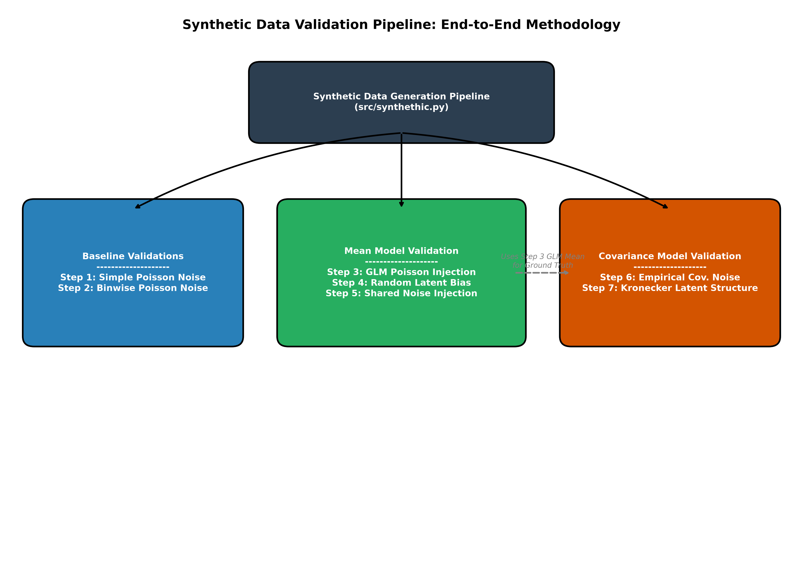
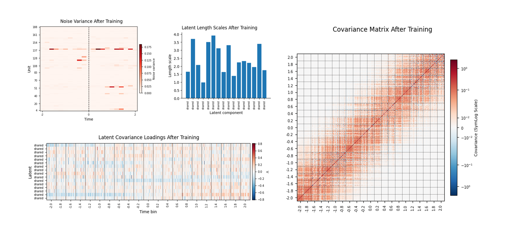
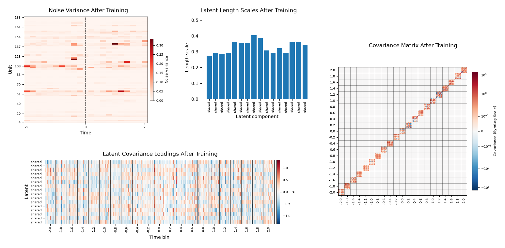
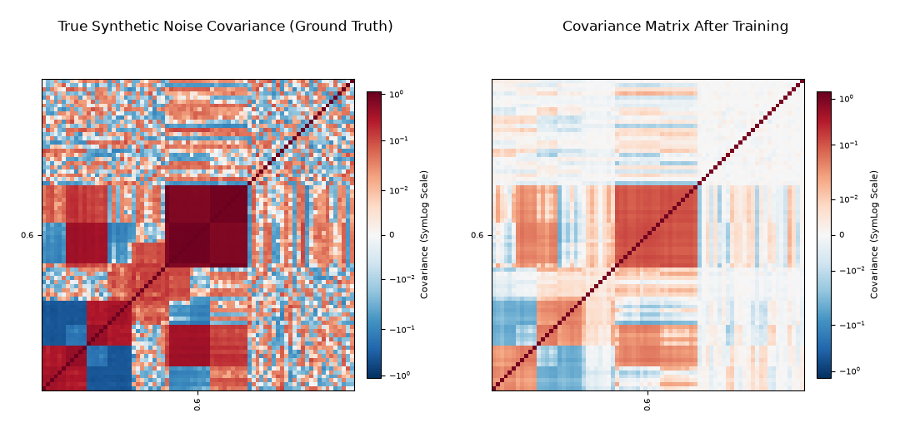
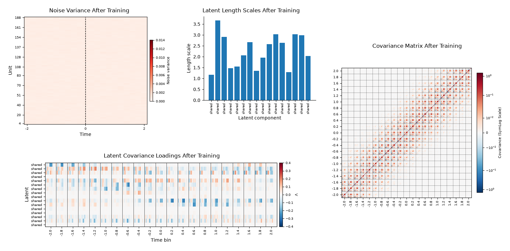

# Parallel Mean-Covariance Model

This project studies neural population coding in freely moving macaque dorsolateral prefrontal cortex (dlPFC) during a self-paced foraging task, using data consistent with the "Population coding of strategic variables during foraging in freely moving macaques" dataset. Single-unit activity was recorded while animals pressed one of two operant buttons for probabilistic rewards, and spikes were binned at 200 ms around each press. The present work develops a latent mean-covariance neural model and interprets it with permutation-based SHAP attribution and null-standardized selectivity analysis.

---

## Methodology Overview

<p align="center">
  
</p>

---

## Model

The proposed framework is a **latent mean-covariance model** that jointly predicts a conditional mean firing-rate trajectory and a structured, low-rank population covariance. For a trial, the model outputs a mean vector $\mu(x)$ and a covariance factor $L$, defining a trial-wise multivariate Gaussian over the flattened bin-unit response vector $y$:

$$y \mid x \sim \mathcal{N}(\mu(x), \Sigma), \qquad \Sigma = LL^\top$$

The mean model is a transformer encoder that maps concatenated spatial and task covariates into a conditional mean trajectory $\mu(t, u \mid x)$ for each unit $u$ and time bin $t$:

$$\mu(t, u \mid x) = f_\theta\big(t2v(t),\; W_{vars} x_t\big)$$

where $x_t$ stacks position, dense-task, and sparse-task variables at bin $t$, $W_{vars}$ projects covariates into the hidden dimension, and $t2v(t)$ is a Time2Vec positional encoding combining linear and sinusoidal components of time.

The covariance model introduces shared latent factors that capture correlated variability across units and time. Each latent component $k$ has a loading matrix $\Lambda_k$ mapping into the flattened bin-unit space, with a temporally smooth Gaussian-process kernel controlling how loadings evolve across the trial:

$$K_k(t, t') = \exp\!\left(-\frac{(t-t')^2}{2\,\ell_k^2}\right)$$

where $\ell_k$ is the learned time scale of latent component $k$. The full covariance combines all latent components with a diagonal noise term:

$$\Sigma = \sum_k \Lambda_k \Lambda_k^\top + \mathrm{diag}(\sigma^2)$$

Latent loadings are initialized near zero so the model starts close to an identity covariance and gradually learns structure, while the mean model is trained first and then frozen so that the covariance component learns residual structure not already captured by the conditional mean.

<p align="center">
  
</p>

**FIGURE 1.** *Fitted shared covariance-model parameters and the resulting full population covariance matrix after training on real empirical data. The panels show the learned latent covariance loadings, temporal length scales, unit- and time-specific noise variances, and the resulting population covariance structure.*

---

## Synthetic Data Verification (src/synthethic.py)

To systematically validate our model's capacity to identify true underlying generative structures, we execute a rigorous synthetic data validation pipeline. The entire pipeline of ground-truth testing (Steps 1 through 7) is procedurally generated using dedicated functions in `src/synthethic.py`. 

The synthetic simulations verify that both the mean model (via SHAP attribution) and the latent covariance model can successfully isolate known mechanisms injected into the data. The steps are categorized as follows:
- **Baseline Validations (Steps 1 & 2):** Simple Poisson and binwise Poisson noise generation to verify basic model convergence.
- **Mean Model Validation (Steps 3, 4, 5):** We inject perfectly known additive GLM effects for specific task variables (like reward or time-since-last-press) and incrementally introduce complex noise (random latent bias, shared noise). We then use SHAP to ensure the model perfectly recovers the ground-truth coefficients without hallucinating spurious dependencies.
- **Covariance Model Validation (Steps 6 & 7):** We test the model's ability to recover complex latent structures.

### Step 6: Empirical Covariance Injection (generate_step6_data)
In Step 6, we stress-test both the mean and covariance components by generating data with a known mean but fully realistic, complex noise. Specifically, `generate_step6_data` takes the strictly controlled GLM mean trajectory $\hat{\lambda}$ generated in Step 3, and adds the raw, unstructured empirical residuals extracted from fitting the baseline model to real data.

By running our full Mean-Covariance model on this synthetic data, we confirm that the nonlinear Transformer mean-model and our SHAP permutation framework accurately isolate the true task-variable dependencies, while the covariance model simultaneously adapts to reconstruct the highly structured empirical noise.

<p align="center">
  
</p>

**FIGURE 2.** *Fitted shared covariance-model parameters extracted from Step 6 synthetic data, where the model successfully isolates the known GLM mean from the injected empirical covariance structure.*

### Step 7: Kronecker Structure Recovery (generate_step7_kronecker_poisson)
In Step 7, we focus strictly on validating the latent covariance architecture. `generate_step7_kronecker_poisson` generates synthetic spikes using the empirical mean, but replaces the residuals with a perfectly known, low-rank Kronecker-structured covariance matrix (a tensor product of independent spatial/unit loadings and temporal/bin Gaussian process kernels).

We then fit our shared latent covariance model to this synthetic data. The objective is to verify that the model correctly converges to the underlying Kronecker structure, capturing the true latent length scales and temporal loadings without overfitting.

<p align="center">
  
</p>

**FIGURE 3.** *Comparison of the injected ground-truth Kronecker noise covariance (Left) against the model's reconstructed covariance matrix after training (Right) for a specific time bin (Bin 13). The model accurately recovers the complex block-diagonal correlation structure injected during synthetic generation.*

<p align="center">
  
</p>

**FIGURE 4.** *Fitted shared covariance-model parameters extracted from Step 7 synthetic data, demonstrating the model's ability to recover the known, injected Kronecker-structured ground-truth covariance.*

---

## Interpretability

Model interpretability was assessed with **permutation-based SHAP** (SHapley Additive exPlanations). SHAP values allocate each unit's predicted firing-rate change at a given bin and trial to individual behavioral and spatial features by averaging marginal contributions over feature subsets:

$$\phi_i(t,u) = \sum_{S \subseteq N \setminus \{i\}} \frac{|S|!\,(|N|-|S|-1)!}{|N|!}\Big[f(S \cup \{i\}) - f(S)\Big]$$

Because exact Shapley computation is infeasible, the implementation approximates $\phi_i$ via Monte Carlo permutations, and attributions are null-standardized against a shuffle-null ensemble to distinguish genuine variable-outcome relationships from baseline variance.

---

## Research Questions

1. Does the covariance component provide predictive information about held-out firing rate beyond what the task-variable-dependent mean model already explains?
2. Are behaviorally relevant units selective for specific strategic variables (movement, reward prediction, reward outcome, action planning), and does this selectivity exceed a shuffle-null baseline?
3. Is population covariance organized by functional role — e.g., reward-prediction versus action-planning units — rather than by unit identity or anatomy alone?

---

## Repository Structure

```
mean-cov-model/
├── mean-cov-model.ipynb   # End-to-end notebook: data → mean/covariance models → interpretation
├── filter_data.m          # MATLAB preprocessing and trial/unit filtering
├── data.mat               # Preprocessed spikes, position, and task-variable data
├── LICENSE
└── src/
    ├── classes.py          # Model and dataset class definitions
    ├── helper_functions.py # Preprocessing, training, and evaluation utilities
    └── plot_functions.py   # Visualization and figure-generation functions
```

## References

- Shahidi N, Franch M, Parajuli A, Schrater P, Wright A, Pitkow X, Dragoi V. (2024). *Population coding of strategic variables during foraging in freely moving macaques.* Nature Neuroscience, 27, 772–781.

- Burghardt R. *Investigating Inter-Area Covariance in the Primate Frontoparietal Reach Network via Latent Space Modelling.* MSc thesis, University of Göttingen. Unpublished; cite as a thesis rather than a peer-reviewed paper.

---

## Citation

If you use this code, please cite the two sources above and link to this repository.
